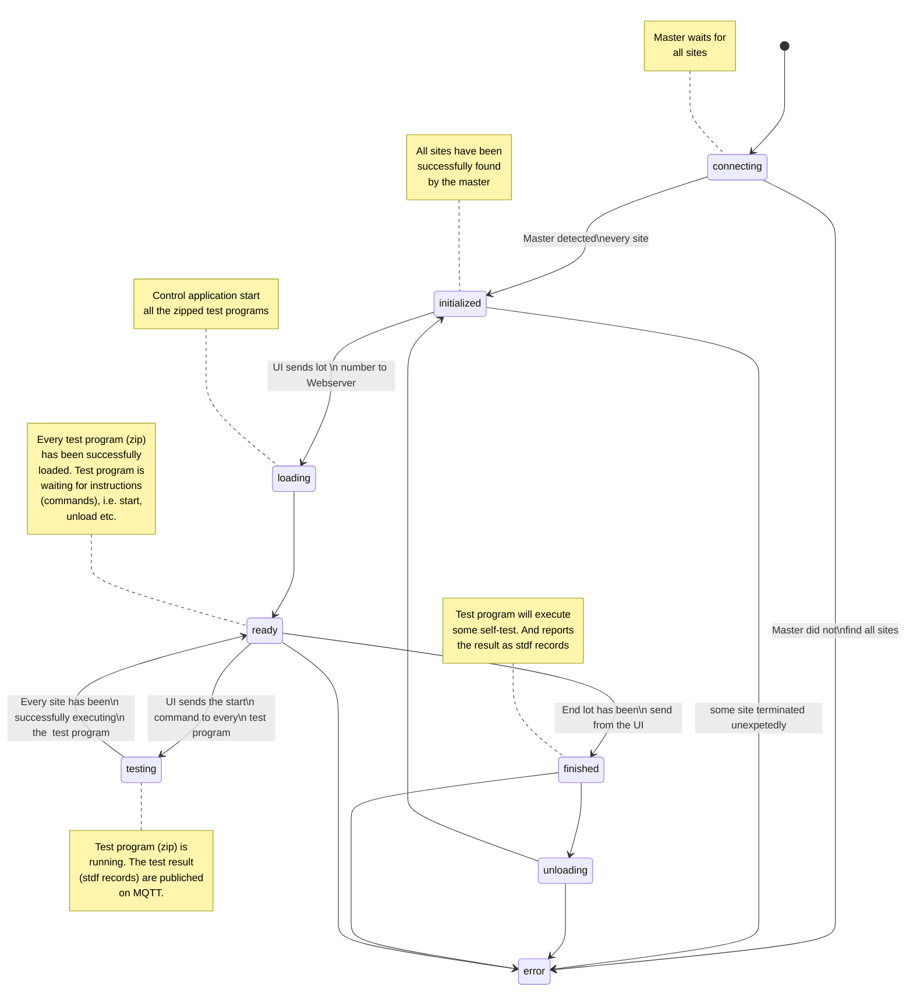

# API zwischen UI und Webserver

Das User Interface (UI) hat die folgenden Aufgaben:

1. Zustand des Testers mit allen seinen Sites darstellen
2. Steuerung der sogenannten Masterapplikation um eine Testprogramm laden und entladen zu können
3. Steuerung der Testapplikation. Einem gestarteten Testprogramm den Befehl zu geben sich auszuführen


## Systemzustände

Um den Zustand des Testers darstellen zu können genügt es die Zustände der Masterapplikation zu betrachten.
Es folgen die Zustände der der Masterapplikation:

1. __connecting__: Tester verbindet sich mit allen Komponenten (MQTT Broker, Sites etc.)

2. __initialized__: Der Tester befindet sich im initialen Zustand. D.h. es ist kein Testprogramm geladen. In diesem Zustand ist lediglich das Laden eines Los möglich. Dieser Zustand kann in den Zustand __loading__ wechseln.

3. __loading__: Der Tester ist aktuell damit beschäftigt ein Testprogramm zu laden. In diesem Zustand kann der Anwender keine Eingaben/Parametrierungen vornehmen.

4. __ready__: Der Tester hat erfolgreich ein Los geladen. Der Anwender hat in diesem Zustand zwei Möglichkeiten. Er kann entweder das Los entladen oder den Befehl zum Teststart geben. Somit sind die Zustände __unloading__ und __testing__ möglich.

5. __testing__: Der Tester ist mit der Ausführung eines DUT-Test beschäftigt. Dieser Zustand wird automatisch wieder verlassen, sobald der DUT-Test ausgeführt ist.

6. __finished__: In diesem Zustand wird das Testprogramm beendet.

7. __unloading__: Der Tester ist mit dem Entladen eines Testprogramms beschäftigt. In diesem Zustand sind keine Benutzereingaben möglich. Anschließend befindet sich der Tester im Zustand __init__.

8. __error__: Prinzipiell kann von jedem Zustand aus der sogenannte Fehlerzustand __error__ betreten werden.

Im Nachfolgenden folgt das Zustandsdiagramm der Masterapplikation

## Zustandsdiagramm der Masterapplikation



## Websockets

Der Datenaustausch zwischen der Webserverkomponente, im Folgenden als Backend (BE) bezeichnet und 
dem UI, im Folgendem als Frontend (FE) bezeichnet soll über Websockets stattfinden.

## Datenformat

Das Datenformat zwischen FE und BE soll JSON sein. Jedes Datum besteht aus mindestens einem Key-Value-Pair
__type__ und einem optionalen Key-Value-Pair __payload__:

```json
{
    "type" : <string>,
    "payload" : <number | string | {}> // optional
}
```

## FE-Komponenten

Zunächst sollen die einzelnen FE-Komponenten betrachten werden. 

### Statuskomponente

Die Statuskomponente des FE ist für die Darstellung der nachfolgenden Informationen verantwortlich. Die hierfür notwendigen Daten werden vom BE als JSON geliefert:

* Systeminformationen
    * __systemName__ Name des Systems zB SCT 3000
    * __environment__ zB. Final 1, Final 2, Final 3, Probe 1, Probe 2 etc.
    * __handler__ Der DUT-Handler zB. Geringer, TEL P8, etc.
    * __time__ System Zeit
    * __log__ Log Informationen 
    * __program__ Der Name des geladenen Testprogramms
    * __num_of_sites__ Anzahl der Sites
    * __state__ ZB. __connecting__, __initialized__, __loading__, __ready__, 
    __testing__, __paused__, __unloading__
    * __mqtt_device_id__ Namespace um sich für sog. MQTT-Topics zu subscriben

* Beispiele:

    * Übertragung des Testernamens:
    ```json
    {
        "type" : "status",
        "payload" : 
        {
            "systemName" : "SCT 3000"
        }
    }
    ```
    * Übertragung der Umgebung/Environment
    ```json
    {
        "type" : "status",
        "payload" : 
        {
            "environment" : "Probe 2",
            "state" : "testing"
        }
    }
    ```
    * Übertragung der Umgebung/Environment und des Testernamens
    ```json
    {
        "type" : "status",
        "payload" : 
        {
            "environment" : "Probe 2",
            "systemName" : "SCT 3000"
        }
    }
    ```
    * Übertragung eines neuen Log-Eintrags
    ```json
    {
        "type" : "status",
        "payload" : 
        {
            "log" : "Test program HACB3 has been loaded successfully"
        }
    }
    ```

### Mqtt-Topic-Subscription / Publishing (UI -> Webserver)

```json
   {
        "type" : "mqtt.subscribe",
        "payload" : {
            "topic" : "device0/master/status",
            "qos" : 0
        }
   }
```

```json
   {
        "type" : "mqtt.publish",
        "payload" : {
            "topic" : "device0/master/status",
            "paylod" : {},
            "qos": 0,
            "retain":false
        }
   }
```
### Mqtt-Topic-Subscription / Publishing (Webserver -> UI)

```json
   {
        "type" : "mqtt.onmessage",
        "payload" : {
            "topic" : "device0/master/status",
            "payload" : "{'alive': 0}",
        }
   }
```


### Controlkomponente

Die Controlkomponente wird zur Steuerung des Testers verwendet. Die Steuerung geschieht durch die Übertragung eines JSON vom FE an das BE.

* Beispiele:

    * Lade Losnummer
    ```json
    {
        "type" : "cmd",
        "command" : "load",
        "lot_number" : 123456.123
    }
    ```
    * Starte Testausführung
    ```json
    {
        "type" : "cmd",
        "command" : "start"
    }
    ```
    * Pausiere Testausführung
    ```json
    {
        "type" : "cmd",
        "command" : "pause",
    }
    ```


