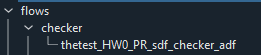

# Semi-ATE Project Development

The development of a Semi-ATE project can only be done in different & sequential stages. Therefore, this document will help to create a tests and integrate&execute them in a test program flow (e.g run tests).

__note__: this document assumes that all project dependencies such as Semi-ATE Plugin, Tester Plugin, etc... are installed and configured (see [semi-ate-packages](../semi-ate-packages))

## Spyder Environment

Spyder is a Graphic IDE that Semi-ATE based on to develop and debug tests.

## Project Setup

Setting up the project shall be done in different sections/stages.

### Definitions Section

All items under this section shall be configured at first to setup&build the base structure of the project to develop tests.


|configuration|PR|FT|
|---|---|---|
|hardwaresetup| X | X|
|maskset|X | X|
|die|X| X|
|package||X|
|device||X|
|product||O|

* Probing(PR)
* Final Test(FT)

The table above provide the setup needed to develop tests in different test phases such as Probing or Final Test.

#### Hadwaresetup

In this section, we will focus on how to configure a hardware setup to be able to use it to write test and run test programs.


The image above shows the view expected when creating/editing a hardwaresetup.
hardwaresetup contains different section to be configured. Though, it's not necessary to configure all of them. Therefore, for simplicity we will introduce optional and non-optional groups

##### Optional

Those optional sections are not necessary for the development of tests but are useful in some scenarios

* Instruments: present external instruments that could be controlled over the network such as with `mqtt`


__note__: instruments are plugin based components that must be installed manually (see [Plugins](../Plugins.md) for more information)

* Actuators: more about actuators in [ActuatorControl](../ActuatorControl.md)


Actuators may be selected for the different development phases and will be automatically integrated in the auto-generated code which will be used directly by the test.

> Actuator are partially implemented so make sure to read documentation([ActuatorControl](../ActuatorControl.md))

* General Purpose Functions: are some helper interfaces that may be used inside a test to fullfil a given task (e.g flatcache provides the tester with an interface to exchange test results with two different testers)

__note__: any selected component from `Instruments`, `Actuators` or `General Purpose Functions` will be automatically integrated in code and could be use in the context of a written test

#### Non-Optional

* Parallelism: describes the strategy the testers shall adapt while testing. It should be at least one configuration available
* Tester: the tester dropdown contains all installed tester plugins that use to implement the tester interface with which the TE may interact with the tester. (see [Plugins](../Plugins.md) for more information)

> __note__: The PCBs section is not a part of this documentation and should be self explained for those with some domain know-how
>
> the following sections are (not) part of the generated code
>
> ```Text
> Maskset
> Die
> Package
> Device
> Product
> ```
>
> but are necessary to develop with Semi-ATE Plugin in Spyder

### Toolbar

The Toolbar may be used to configure and filter the tree view such enabling or disabling some of the sections.


The Toolbar provide a way to select the different configuration already defined in the [definition](#definitions-section) section:

* select the [hardwaresetup](#hadwaresetup)
* select the test phase PR or FT
* select the target (e.g `die` for PR phase and `device` for FT phase)
* hide/show groups

### Tests Section

This section is only enabled if stage one is completed (e.g a configuration is generated and is selected using the [Semi-ATE toolbar](#toolbar))


As seen above the test section is activated and below are the standard test groups where a test could be located/grouped.


__note__: The test groups are only virtual (e.g they do not exist physically in the file system)

#### Generate and Configure Tests

Filling the required fields and apply the configuration will generate a test that should directly be added to the tree.


Creating a test will update the tree and the test will be available under the corresponding groups.
(below is an example of a newly created test `contact` which belongs to the `engineering` group)


#### Write Tests

Generating a test as described above will automatically generate code that may be used to write tests.

```python
    ...

    def do(self):
        """Default implementation for test."""
        ...
        self.op.new_parameter1.default()

    ...

```

The generated code is a valid python code that may be used and executed.
Though, the test literally doesn't do anything other than setting the output parameter to a default value. The `do` function is basically all we need to write tests, so in this section we will discuss
how to write tests and how to integrate the tester and operate on the hardware.

The test will be provided with the a `context` objects container which contains all available interfaces such as instrument/actuator/tester...

The context could be used as follow:

```Python
self.context.tester.<operate_on_hardware>
```

__note__: Spyder-IDE will provide the auto completion support needed to select the right interface

__note__: operating on the tester may require tester specific knowledge

### Flows Section

The test programs will also be sorted same as tests


Creating or Editing a test program shall show the same view as shown below:


Creating a test program will update the tree and the test program will be available under the corresponding group



> do we need to describe how to use the test program wizard ?

__note__: Unlike the test code the test program code shall never be edited as it contains automatically all information to run the associated tests

#### Toolbar Extension


__note__: the extension is not a part of Semi-ATE Plugin

### Auto Script

The auto script is a hardwaresetup specific interface which is used by the test program to execute user code automatically.

The auto script has the following interface:

```python
    ...
    def before_start_setup(self):
        pass

    def after_cycle_teardown(self):
        pass

    def after_terminate_teardown(self):
        pass

    def after_exception_teardown(self, source: str, exception: Exception):
        pass
```

The functions listed above will be executed automatically at the different test program execution stages, for instance:

* `before_start_setup`: will be called as soon the test program starts
* `after_cycle_teardown`: will be called after running a complete test program flow
* `after_terminate_teardown`: will be called when the unload command is received
* `after_exception_teardown`: will be called when exceptions in a valid python code occur
