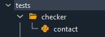
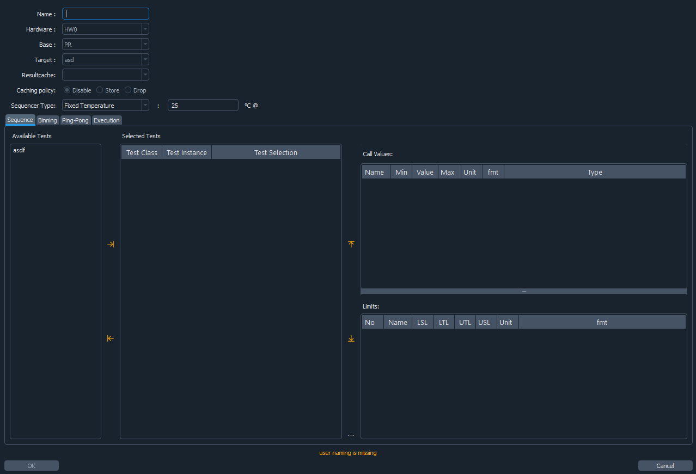

# Semi-ATE Project Development

The development process of a Semi-ATE project requires a specific order of different configuration steps.
This document will help to create and execute a test in a test program flow.

__note__: this document assumes that all project dependencies such as Semi-ATE Plugin, Tester Plugin, etc... are installed and configured (see [semi-ate-packages](../semi-ate-packages))

## Spyder Environment

Spyder is a plugin based IDE that Semi-ATE depends on and will be used to develop and debug tests.

## Project Setup

Setting up the project shall be done in different sections/stages.

### Definitions Section

All items under this section shall be configured at first to setup and build the base structure of the project.


|configuration|PR|FT|
|---|---|---|
|hardwaresetup| X | X|
|maskset|X | X|
|die|X| X|
|package||X|
|device||X|
|product||O|

* Probing(PR)
* Final Test(FT)

The table above provides the setup needed to develop tests in different test phases such as probing or final Test.

#### Hadware Setup

In this section, we will focus on how to configure a hardware setup to be able to use it to write test and run test programs.


The image above shows the view expected when creating/editing a hardware setup.
A hardware setup contains different sections to be configured. Though, it's not necessary to configure all of them.
Therefore, for simplicity we will introduce optional and non-optional groups.

##### Optional

The optional sections are not necessary for the development of tests but are useful in some scenarios.

* Instruments: During test execution available instruments that are accessed and controller via `mqtt` over ethernet.


__note__: instruments are plugin based components that must be installed manually (see [Plugins](../Plugins.md) for more information)

* Actuators: more about actuators in [ActuatorControl](../ActuatorControl.md)


Actuators may be selected for the different development phases and will be automatically integrated in the auto-generated code which will be used directly by the test.

> Actuator are partially implemented so make sure to read documentation([ActuatorControl](../ActuatorControl.md))

* General Purpose Functions: helper interfaces that are used inside a test to provide a specific functionality like flatcache. Flatcache provides support for exchanging test results among different testers.

__note__: any selected component from `Instruments`, `Actuators` or `General Purpose Functions` will automatically be integrated in the generated code and can be accessed/used when implementing a test.

#### Non-Optional

* Parallelism: describes the alignment the testing sites shall adapt while testing.

__note__: It should be at least one configuration available

In case of a single site:


In case of multi-sites:


* Tester: the tester dropdown contains all installed tester plugins that implements the tester interface with which the test engineer may interact with the tester. (see [Plugins](../Plugins.md) for more information)

> __note__: The PCBs section is not a part of this documentation.
>
> the following sections are (not) part of the generated code
>
> ```Text
> Maskset
> Die
> Package
> Device
> Product
> ```
>
> but are necessary to develop in Semi-ATE environment.

### Toolbar

The toolbar may be used to configure and filter the tree view such enabling or disabling some of the sections.


The toolbar provide a way to select the different configuration already defined in the [definition](#definitions-section) section:

* select the [hardwaresetup](#hardwaresetup)
* select the test phase PR or FT
* select the target (e.g `die` for PR phase and `device` for FT phase)
* hide/show groups

### Tests Section

This section is only enabled if stage one is completed (e.g a configuration is generated and is selected using the [Semi-ATE toolbar](#toolbar))


As seen above the test section is activated and below are the standard test groups where a test could be virtually located/grouped.



__note__: The test groups are only virtual (e.g. they do not exist physically in the file system).

#### Generate and Configure Tests

Filling the required fields and apply the configuration will generate a test that will be automatically appended to the tree.


The image below shows an example of test named `contact` for the `engineering` group.


#### Write Tests

Generating a test as described above will automatically generate code that may be used to write custom test code.

```python
    ...

    def do(self):
        """Default implementation for test."""
        ...
        self.op.new_parameter1.default()

    ...

```

The test literally doesn't do anything other than setting the output parameter to a default value.
The `do` function is basically all we need to write tests.

The test will be provided with a `context` objects which contains all available interfaces such as instruments/actuators/tester...

The context could be used as follow (more [here](./TestInterface.md)):

```Python
self.context.tester.<operate_on_hardware>
```

__note__: Spyder-IDE will provide the auto completion support needed to select the corresponding members and functions.

__note__: operating on the tester may require tester specific knowledge.

### Flows Section

The test programs will also be grouped in the same style as tests.


Creating or editing a test program will open the following wizard:



The created test program will be available under the corresponding group.

__note__: Unlike the test code the test program code shall never be edited as it contains all information to run the associated tests.

#### Toolbar Extension


__note__: The extension is not a part of the Semi-ATE Plugin.

### Auto Script

The auto script is a hardware setup specific interface which is used by the test program to execute user code automatically.

The auto script has the following interface:

```python
    ...
    def before_start_setup(self):
        pass

    def after_cycle_teardown(self):
        pass

    def after_terminate_teardown(self):
        pass

    def after_exception_teardown(self, source: str, exception: Exception):
        pass
```

The functions listed above will be executed automatically at the different test program execution stages, for instance:

* `before_start_setup`: will be called once in the beginning of a test program start.
* `after_cycle_teardown`: will be called after running a complete test program flow.
* `after_terminate_teardown`: will be called when the unload command is received.
* `after_exception_teardown`: will be called when exceptions in a valid python code occur.
