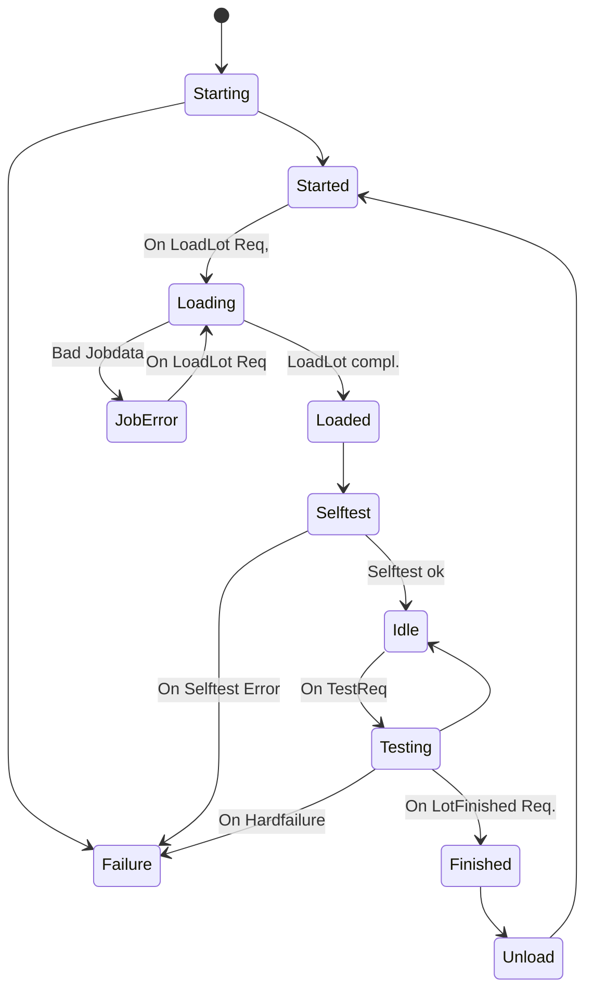

```mermaid
stateDiagram
[*] --> Starting
Starting --> Started
Starting --> Failure
Started --> Loading: On LoadLot Req,
Loading --> Loaded: LoadLot compl.
Loading --> JobError: Bad Jobdata
JobError --> Loading: On LoadLot Req
Loaded --> Selftest
Selftest --> Idle: Selftest ok
Selftest --> Failure: On Selftest Error
Testing --> Idle
Testing --> Failure: On Hardfailure
Idle --> Testing: On TestReq
Testing --> Finished: On LotFinished Req.
Finished --> Unload
Unload --> Started
```