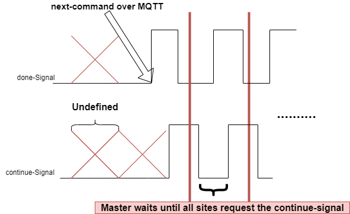

# Harmonize test execution via Plugin
To make sure, the execution of tests in a running testprogram in different sites is synchronized, the
testprogram instance would always wait for a go signal from the Master application to proceed the execution of the next test.


## Synchronization Master and Tester
The testprogram execution will be driven by the master application. Therefore, the master should be able to identify the Tester type, ether a MaxiSCT or MiniSCT. 

* In case of MaxiSCT:
    * The test execution will be synchronized via a wire connection between a MaxiSCT and some MiniSCTs, e.g. 
    * Each MiniSCT will be connected to the MaxiSCT with two different GPIOs 
        * one GPIO is used from the MaxiSCT to signalize execution release 
        * second one is used from the MiniSCT to signalize a synchronization request or. one test is executed
* In case of only one MiniSCT, there is no need to synchronize. the test execution may be automatically released each time a request is triggered

## Test Execution Scenario
### case of MaxiSCT & MiniSCTs
* Before each new test program executes, the Master sends a next command over mqtt to signalize that the MiniSCT should
change it's state to testing and be ready to receive the continue-signal to run the first test.

Remark: we still need to keep the next-cmd to transmit user settings infos (e.g. stop-on-fail, etc..)

* After each test execution the MiniSCTs send a Signal to the MaxiSCT to signalize that the test is executed and they are waiting for the continue-Signal to execute the next test
* the Diagram below illustrates how the communication MaxiSCT and MiniSCTs looks like


### case of only one MiniSCT
As we only have one MiniSCT, the continue-signal will be simulated by the MiniSCT itself.
there is not need to synchronize.


## Tester Plugin Interface
### Master Tester Interface

Master Application shall know how to synchronize the available MiniSCT and be able to use the Tester Plugin to control their tests execution.

Tester Plugin should implement the following functions:
 
*   ```python
    def release_test_execution(sites: list)
    ```
    the __release_test_execution__ function will be used to signalize that the next test for the specified sites, can run.
    this event is needed as soon as all requests from all defined sites are received.

    * In case of MaxiSCT, all specified sites will receive a signal to carry on with tests, such that the outputs connected to each of them will be set to high or low according to specification. 
    * In case of MiniSCT, there is not going to get a hardware signal since the MiniSCT is where we run the tests.
    
        * Therefore, the master should in this case send the command via mqtt
        * or we can simulate the connection and handle all the communication in a file. This approach requires that the master application is running on the MiniSCT itself (could be a bit faster than mqtt)

* ```python
    async def get_sites_states(timeout: int) -> list
    ```
    the __get_sites_states__ is an async function that returns a list of all GPIOs suppose to be connected to a MSCT (list length = 16) within a given timeout.
    * in case of MaxiSCT, each of the outputs connected to a MiniSCT should be read and evaluated
    * in case of MiniSCT, this function could be ignored


### TestProgram Tester Interface
Test Program should after each test execution signalize, that it is ready to carry on with the next test, then wait til the master application sends a response to continue the execution.

Tester Plugin should implement the following function:

*  ```python
    def do_request(site_id: int, timeout: int) -> bool
   ```

   __do_request__ function will be called as soon as a next command is received
   depend on the type of the Tester ether MaxiSCT or MiniSCT, we can determine which form the request should take e.g.:

    * In case of MaxiSCT, set the output connected to the MaxiSCT to high and wait until the release signal is set or timeout 
    * in case of MiniSCT: the function will return always true. Tests must not be synchronized in this case.

*  ```python
    def test_in_progress(site_id: int)
   ```

   __test_in_progress__ function signalize the site is busy (e.g testing)


*  ```python
    def test_done(site_id: int, timeout: int)
   ```

   __test_done__ function signalize that the site is done with testing and wait to be released again 
   
*  ```python
    def do_init_state(site_id: int)
   ```

   __do_init_state__ function sets the tester gpio state to low


## Signal Flow

The signal flow describes the low-level communication between Maxi- and Mini-SCT.
The done-signal is the one controlled by the Mini-SCT, which should switch to high as soon 
a next-command (over mqtt) is received. the continue-Signal is controlled by the Maxi-SCT.

hint: the states taken by the signals done-Signal and continue-Signal before receiving 
(case of MiniSCT) and sending (case of MaxiSCT) of next command do not affect the system.
the next command triggers the state transition of both Maxi- and Mini-SCT to testing and 
from that point the signal would be significant and should be handled carefully.




Assuming the next-command is send, and both Maxi- and Mini-SCT update their state to testing.
the MiniSCT sets the done-signal to high to signalize that its ready to execute.
the MaxiSCT shall in that case read the done-signal of all configured sites and sets 
the continue-signal to high to signalize a test start (all sites should set the 
done-signal to high)

As soon as the MiniSCT executes a test, sets its done-signal to low to signalize the active
testing state. the MaxiSCT sets then the continue signal to low and wait until it sees a
high done-signal.
