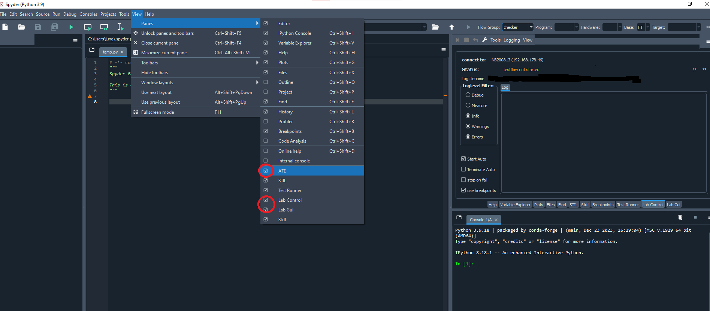

Last change: |today|

Getting Started with ATE for developers
=======================================

This document describes how to install semi-ate for developers to develop and test your test-flows. For example, for evaluation a sensor device or to use a test flow later in production.

You will be guided how to install the required *conda packages*, to configure `spyder <https://www.spyder-ide.org/>`_ with different plugins, so that you can then create 
test sequences with different tests with relatively little effort.

We assume the following
-----------------------

* You have `maxiconda <https://www.maxiconda.org/>`_ installed (maxiconda is comparable to `Anaconda <https://www.anaconda.com/>`_ but completely license-free).
  You should not install maxiconda as an administrator, otherwise you need admin rights for each package that is to be installed later. 
  This is not practical. And you should install maxiconda only for you, not for all users.
  Maxiconda is not running together with Anaconda, you  have to  deinstall Anaconda first!
  And if c:\\users\\<your username>\\.condarc exist, than remove this file.
	  
* You are running *Windows 10 64Bit* or an *linux system*.

MQTT
----

The components use MQTT for communication, so an MQTT server must
be available. The easiest solution is to use HBMQTT, which is a
Python based broker. It can be installed via PIP or conda/mamba.

You can also use `mosquitto <https://mosquitto.org/download/>`_.
Download and install as administrator to your PC (ask your IT service desk for support).

Environment:
____________

create new environment (conda/mamba)
------------------------------------

   >>> (maxiconda) PS:> conda init     // once you initialize conda in your custom terminal using
   >>>                                 // this command or
   >>>                                 // you are using conda terminal you don't need to run it again
   >>> (maxiconda) PS:> conda create -n Semi-ATE  python=3.9 spyder=5.5.6

activate environment
--------------------

  >>> (maxiconda) PS:> conda activate Semi-ATE
  >>> (Semi-ATE) PS:> conda config --append channels conda-forge

Install Semi-ATE packages for developers
----------------------------------------

  >>> (Semi-ATE) PS:> mkdir -p ~/repos/Semi-ATE					//or use a directory of your choice
  >>> (Semi-ATE) PS:> cd ~/repos/Semi-ATE
  >>> (Semi-ATE) PS:> git clone https://github.com/Semi-ATE/Semi-ATE.git
  >>> (Semi-ATE) PS:> cd Semi-ATE
  >>> (Semi-ATE) PS:> python scripts/package_tool.py --change-env cicd
  >>> (Semi-ATE) PS:> cd src/ATE_spyder/ate_spyder_lab_control
  >>> (Semi-ATE) PS:> pip install -e .

Running Spyder
--------------

To launch the Spyder IDE navigate to the Spyder folder and activate the previously created environment, then run the following
command:

   >>> (maxiconda) PS:> conda activate Semi-ATE
   >>> (Semi-ATE) PS:> spyder

than check View->Panes and enable the necessary panes

   

and View->Toolbars
   
 .. image:: _static/pictures/semiate_enable_toolbar.png
   :width: 400
   :class: hover400
   :alt:   Spyder_enable_docstyle
   

Now we are ready to open an existing project or create a new one.

* We have prepared an :ref:`exampleproject`.  to help you get started quickly.
* or you read the capital :ref:`semiatedevelopment`.