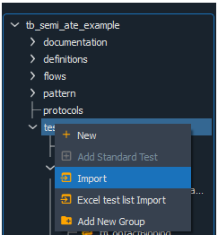
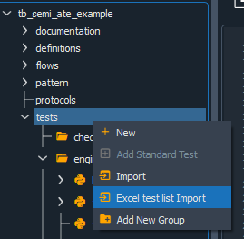
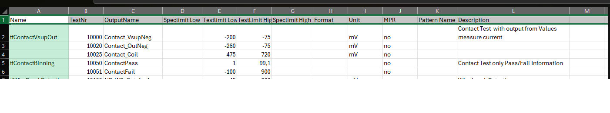
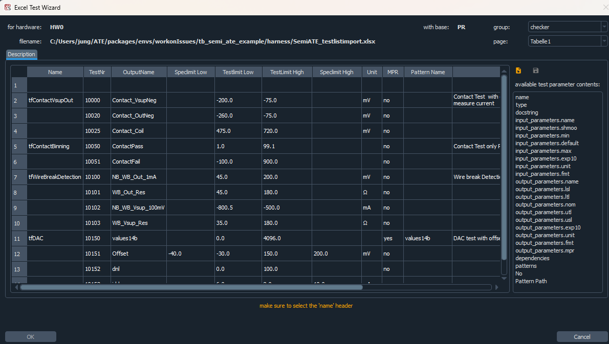
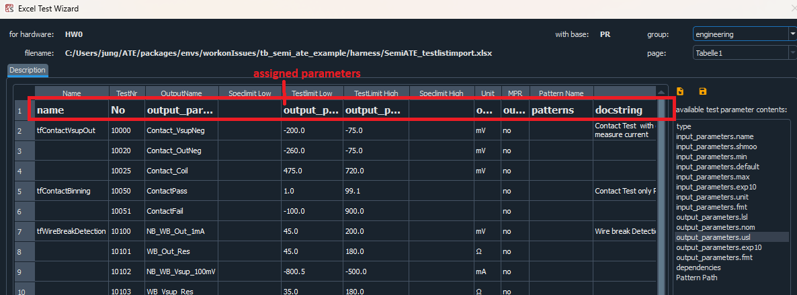
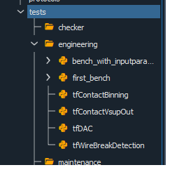

# Import/Export

Import and Export of Tests is supported by the IDE.

### Export

User is able to import a test via right click on test from within Spyder IDE. Automatically, the exported file will be the name of the test and followed by a unique extension '<test_name>.ate'
__test_name__: could be changed
__.ate__: extension should not be changed, changing the extension will prevent importing the test 

### Import

Import is also supported from within Spyder IDE. 

the following cases are supported:
* import of non-existing test: a new test will be automatically generated and persisted
* import of already defined test: user will be provided in this case with a pop-up dialog in which three possible action are suggested:
    1. rename and followed with an input text, in which the user is able to put the new name of the exported test (rename existing test in this case is not possible)
    2. overwrite: the existing test will be in this case deleted and overwritten with the content of the imported test
    3. cancel: no changes will take place
* import of test with different version number: this case is not supported, no import is possible

### Import Excel Test list

This allows you to create the basic structure of the test benches from an Excel list with just a few clicks.
An example is available in the [demo](exampleProject/exampleproject.rst). In the demo, you can find a relevant Excel file in the ‘harness’ directory.
The Excel list contains the test names and the various input/output parameters:

Open the Excel file via the Excel Test List Import.
The names and order of the columns in the first row can be chosen freely and are then mapped in the Excel Test Wizard.

The column on the far right lists the available parameters. You can then assign a parameter to a column by selecting it and dragging it onto the relevant column.
You can use the Save/Load icon to save the assignment and load it again next time.
Any errors will be displayed in orange below the table. These must be rectified before the ‘OK’ button becomes active. 

Once ‘OK’ has been selected, the respective basic structure of the test benches will be created using the specified parameters.

