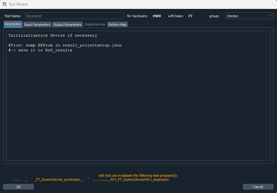
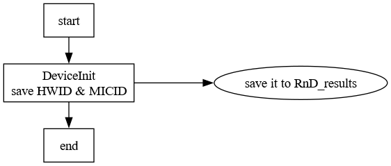

# Some script for project documentation

There are various scripts for creating documentation for projects within semi-ate:

createFlow [-h] [--path PATH] --project PROJECT --version VERSION [--hw HW] [--base BASE] [--target TARGET]
                [--group GROUP] [--name NAME]

    Creates a graphical representation from a flow of Semi-Ate, with comments taken from the description of the individual tests.

    Various tags are available for formatting:
        “#Flow:”     Instead of the general description, the string after the tag 
                     is used.
                     If additional lines are used, they must be indented.
        "->"         The string is then displayed in a separate node, which is 
                     arranged horizontally to the previous box.
                     The Tag "#Flow:" must have been used previously.
        ":"          indicates a summary of tests. The 'test name' is the string
                     between #flow and the :.

Example:

and the generated png:

