# Handler
Das Handlerinterface beschreibt die Schnittstelle zum Handler. Jedes neue Handlerprogramm muss diese Schnittstelle komplett implementieren um mit dem Rest des Systems kompatibel zu sein.

## Befehle die vom Handler verstanden werden

Der Master empfängt Befehle im Topic Handler/command. Alle Befehle, auf die eine Antwort geschickt wird postet der Master im Topic Handler/response. Achtung, ein Handler, der mehrere Tester steuert ("Sockets" in MMS!) muss für jeden Tester die entsprechenden Topics abonnieren, d.h.: Ein Handler steuert die Tester mit den Device Ids "Foo" und "Bar". Daraus folgt, dass er für die Befehlsverarbeitung mit folgenden Topics arbeiten muss:
* ATE\Foo\Handler\command
* ATE\Foo\Handler\response
* ATE\Bar\Handler\command
* ATE\Bar\Handler\response

### identify
Der "identify" Befehl weist den Handler an seinen Namen zu schicken.
Dies ist die Antwort auf den **identify** Befehl Type (Master command)
```json
{
    "type": "identify",
    "payload": {}
 }
```

Antwort durch den Handler

```json
{
    "type": "name",
    "payload": {"name": ""}
 }
```

### get-state
Der get-state Befehl weist den Handler an seinen Internen Zustand zu schicken.

```json
{
    "type": "get-state",
    "payload": {}
 }
```

Antwort durch den Handler

```json
{
    "type": "state",
    "payload": {"state": "",
                "message": ""
               }
 }
```

Der Wert für State darf einer von folgenden Werten sein.
|  Wert | Interpretation  | Konsequenz in Master|
|-------|-----------------|---------------------|
| Ok    | Handler läuft   |       keine         |
| Error | Handler ist im Fehlerzustand | Master wechselt in Softerror und nimmt keine Testbefehle mehr an |

Diese reduzierten Zustände dienen dem Master lediglich dazu herauszufinden, ob er Testbefehle entgegen nehmen darf. Derzeit gibt es auf Seiten des Masters keine Notwendigkeit mehr Details des Handlerzustands zu kennen.


### get-temperature
Der get-temperature Befehl weist den Handler an die Temperatur zu schicken, die im Testbereich des Testers herrscht, der die Anfrage geschickt hat. D.h. der Handler muss in diesem Fall auswerten auf welchem Befehlstopic die Anfrage kam um zu wissen, welche Temperatur verlangt ist.

```json
{
    "type": "temperature",
    "payload": {}
 }
```

```json
{
    "type": "temperature",
    "payload": {"temperature": 25}
}
```

### error
Erhält der Handler einen Befehl, den er nicht bearbeiten kann, oder den er nicht unterstützt so darf er mit einem Error Paket antworten.
```json
{
    "type": "error",
    "payload": 
        {
            "command": "<Befehl, das den Fehler ausgelöst hat>",
            "message": "<Fehlermeldung im Klartext>"
        }
}
```

### send-layout
Handler sendet beim Hochfahren folgende Nachricht an Master:
```json
{
    "type": "site-layout",
    "payload":
    {
        "sites": [[0,1], [1,0]]
    }
}
```

* sites: ist ein Liste an Koordinaten für die definierten Test sites
         (die Position eine Koordinate entspricht die Seite-Nummer)

```mermaid
stateDiagram
    [*] --> connecting
    connecting --> initialized: Handler detects\nevery site
    note left of initialized
        All Testers have been
        successfully found
        by the Handler.
    end note
    initialized --> error
    connecting --> error: Handler did not\nfind all Testers
    note left of connecting
        Hanlder waits for
        all Testers.
    end note
    initialized --> loading: Handler sends lot\nnumber to Tester
    note right of loading
        Handler waits for
        test program to be loaded.
    end note
    loading --> ready: loading test\nprogram is completed
    note right of ready
        Every test program
        is successfully
        loaded by the Tester.
    end note
    ready --> testing: Handler sends start\nor retest command
    note right of testing
        Tester tests.
    end note
    testing --> ready: Tester sends\ntest result
    note right of testing
        Tester runs test program once.
    end note
    ready --> unloading: Handler sends\nlot end
    note right of unloading
        Handler is waiting to receive
        lot end response from Tester.
    end note
    unloading --> initialized: unloading of\ntest program\nis completed
    unloading --> error
    loading --> error: Tester response\nwith an error
    ready --> error
    testing --> error
```



